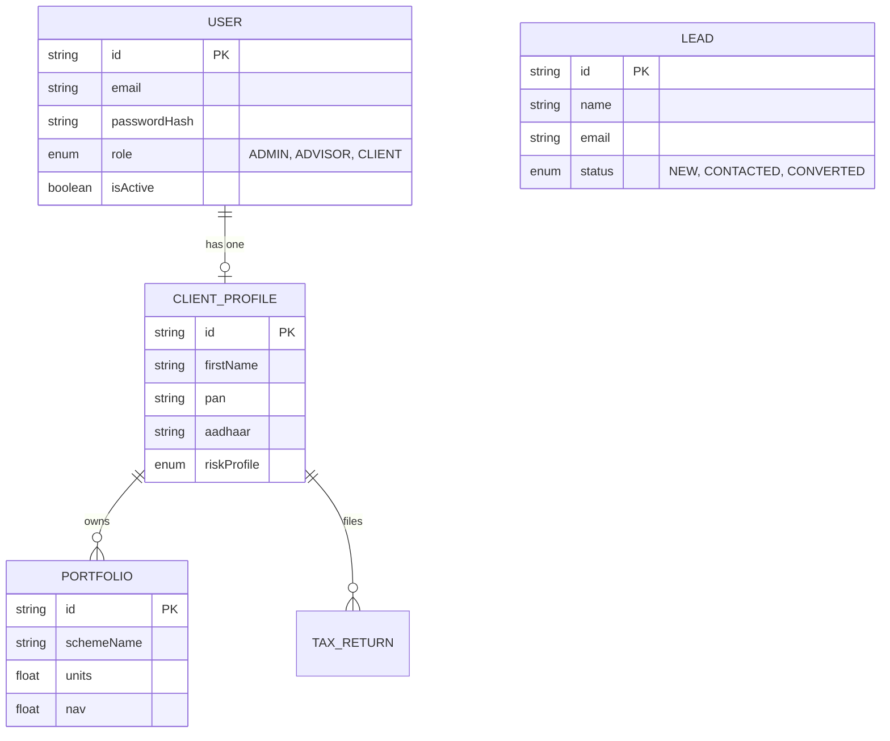
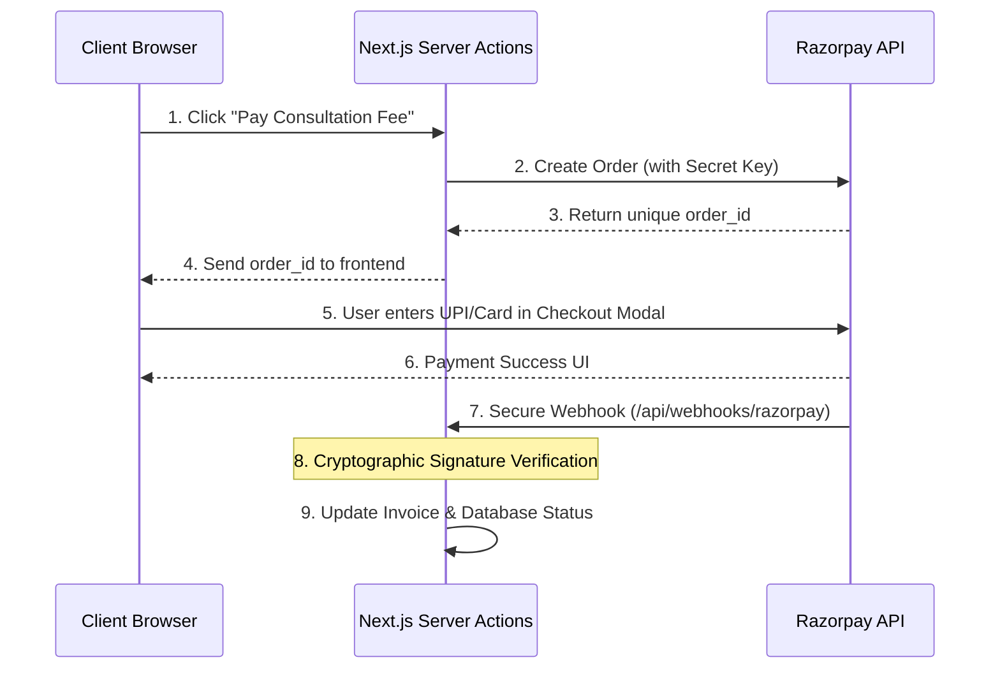

# Shree Sai Services - Enterprise Architecture & Technical Specification

> **Confidentiality Notice**: This document contains proprietary architectural designs, business logic, and security protocols for the Shree Sai Services platform. 

---

## 📖 Table of Contents
1. [Executive Summary & Business Vision](#1-executive-summary--business-vision)
2. [System Architecture & Tech Stack](#2-system-architecture--tech-stack)
3. [Database Schema & ER Diagram](#3-database-schema--er-diagram)
4. [Application Workflow & Business Logic](#4-application-workflow--business-logic)
5. [Security & Role-Based Access Control (RBAC)](#5-security--role-based-access-control-rbac)
6. [Payment Gateway Integration Logic](#6-payment-gateway-integration-logic)
7. [Developer Setup & Deployment Guidelines](#7-developer-setup--deployment-guidelines)

---

## 1. Executive Summary & Business Vision

**Shree Sai Services** is a next-generation financial advisory and tax consultancy platform. Designed explicitly for the Indian financial sector—with specialized localization for Maharashtra's demographic—the platform bridges the gap between public lead generation and private wealth management.

### Dual-Ecosystem Design
1. **The Public Marketing Engine**: A highly optimized, SEO-friendly Next.js landing site designed to capture leads for Income Tax Planning, Mutual Fund Advisory, and Holistic Financial Planning. 
2. **The Secure CRM & Client Portal**: A heavily fortified, authenticated ecosystem. It empowers financial advisors to manage their practice (CRM) while offering clients a transparent portal to track their portfolios and tax filings in real-time.

---

## 2. System Architecture & Tech Stack

The application leverages the latest **Next.js 16 App Router** paradigm, utilizing React Server Components (RSC) to minimize client-side javascript and maximize SEO performance.

### Technology Stack Breakdown
| Layer | Technology | Purpose |
| :--- | :--- | :--- |
| **Framework** | Next.js 16 (App Router) | Core routing, Server-Side Rendering (SSR), API routes. |
| **Frontend UI** | React 19, Tailwind CSS v4 | Component architecture, responsive utility-first styling. |
| **UI Library** | Shadcn UI, Base UI | Accessible, headless, and customizable UI components. |
| **Database ORM** | Prisma v6 | Type-safe database queries and schema migrations. |
| **Database Engine**| SQLite (Dev) / Neon PostgreSQL | Relational data storage for clients, leads, and portfolios. |
| **Authentication** | Custom JWT (`jose`), `bcryptjs`| Stateless, secure HTTP-only cookie-based session management. |
| **State & Forms** | React Hook Form, Zod | Client-side form management and strict schema validation. |

### High-Level Architecture Diagram


---

## 3. Database Schema & ER Diagram

The database is highly relational, ensuring data integrity between user credentials, client profiles, and financial assets.



---

## 4. Application Workflow & Business Logic

### A. The Lead-to-Client Conversion Pipeline
1. **Capture**: A prospect fills out the "Book Consultation" form on the public site.
2. **CRM Pipeline**: The lead appears in the Admin's interactive Kanban board. The board uses `@hello-pangea/dnd` for fluid drag-and-drop state management.
3. **Provisioning**: When an Admin clicks "Convert to Client," a Server Action automatically:
   - Creates a `ClientProfile` record.
   - Generates a linked `User` record with a default secure password (`Welcome@123`).
   - Dispatches a welcome email via webhook (Future scope).

### B. Tax Return Lifecycle
- Clients upload Form 16s securely in their portal.
- Advisors review documents and update the Tax Return status (`PENDING_DOCS` -> `FILING_INITIATED` -> `ITR_FILED`).
- Real-time updates reflect instantly on the client's dashboard without page reloads using Next.js `revalidatePath`.

---

## 5. Security & Role-Based Access Control (RBAC)

Security is paramount for financial data. We do not rely on third-party auth providers (like NextAuth or Clerk); instead, we maintain full control via a custom JWT implementation.

### Edge Middleware Logic (`proxy.ts`)
The `proxy.ts` file acts as an impenetrable gateway intercepting every request:
1. **Token Extraction**: It looks for the `shreesai_session` HTTP-only cookie.
2. **Cryptographic Verification**: It uses `jose` to verify the JWT signature using `JWT_SECRET`.
3. **Role Routing Table**:
   - If `Role === CLIENT` attempts to access `/dashboard` → **Redirect to `/portal`**
   - If `Role === ADMIN` attempts to access `/portal` → **Redirect to `/dashboard`**
   - If Unauthenticated attempts to access `/portal` → **Redirect to `/login`**

> **Note**: Public paths (like `/`, `/about`, `/book-consultation`) completely bypass authentication checks to ensure maximum SEO indexing and page load speeds.

---

## 6. Payment Gateway Integration Logic

To comply with RBI guidelines and ensure PCI-DSS compliance, the platform utilizes a Server-to-Server Payment Architecture via **Razorpay**.

### Integration Flowchart


### e-Mandates (Recurring Advisory Fees)
For holistic wealth management retainers, Advisors generate a recurring mandate link. Once the client authorizes the e-NACH via Net Banking, Razorpay automatically deducts the fee monthly, triggering a webhook to our server to generate the monthly GST invoice.

---

## 7. Developer Setup & Deployment Guidelines

### Environment Variables
Create a `.env` file in the root directory. **Never commit this file to version control.**
```env
# Database configuration
DATABASE_URL="file:./dev.db" # Or Neon PostgreSQL string

# Cryptography (Generate a secure 64-char random string)
JWT_SECRET="your_super_secret_cryptographic_key_here"

# Payment Gateway (Razorpay)
RAZORPAY_KEY_ID="rzp_test_xxxxxx"
RAZORPAY_KEY_SECRET="your_razorpay_secret"
```

### Local Setup Commands
```bash
# 1. Install precise dependencies
npm install

# 2. Push database schema to local SQLite
npx prisma db push

# 3. Generate Prisma Client for type safety
npx prisma generate

# 4. Seed the database (creates admin@shreesaiservices.com / password123)
npm run prisma:seed

# 5. Start Turbopack dev server
npm run dev
```

### Production Deployment (Vercel & Neon DB)
1. Provision a Serverless PostgreSQL database on Neon.tech.
2. Update the `DATABASE_URL` in Vercel Environment Variables.
3. Connect the GitHub repository to Vercel for automatic CI/CD deployments. Next.js App Router is optimized for Vercel's Edge Network, automatically distributing static assets to global CDNs while running Server Actions on secure Node runtimes.
